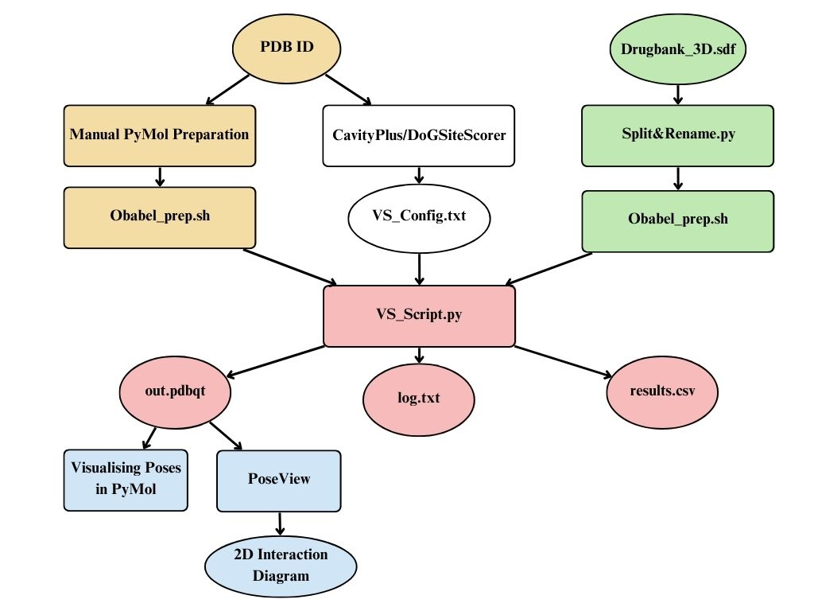

# Virtual Screening Pipeline: In Silico Docking Workflow

# Table of Contents

- [Introduction](#introduction)
- [Requirements](#requirements)
- [General Overview of the Protocol](#general-overview-of-the-protocol)
- [Steps of the Workflow](#steps-of-the-workflow)
  - [RCSB PDB](#rcsb-pdb)
  - [Visualising the Protein in PyMol](#visualising-the-protein-in-pymol)
  - [Manual Protein Preparation on PyMol](#manual-protein-preparation-on-pymol)
  - [Saving the Cleaned Receptor](#saving-the-cleaned-receptor)
  - [Receptor Preparation with Open Babel](#receptor-preparation-with-open-babel)
  - [Ligand Preparation](#ligand-preparation)
  - [Energy Minimization](#energy-minimization)
  - [Convert Ligands to PDBQT](#convert-ligands-to-pdbqt)
  - [Binding Pocket: Defining the Grid Box](#binding-pocket-defining-the-grid-box)
  - [Other Arguments of the Config. File](#other-arguments-of-the-config-file)
  - [Running VS_Script.py](#running-vs_scriptpy)
  - [Output Files](#output-files)
  - [2D Interaction Diagram](#2d-interaction-diagram)
  - [Adjustment for Running on High Performance Computing Node (HPC)](#adjustment-for-running-on-high-performance-computing-node-hpc)
- [Citations for Tools and Software](#citations-for-tools-and-software)

---

## Introduction
This repository aims to carry out a virtual screening pipeline to counter ESKAPE pathogens which are infamous for being resistant to treatment by conventional antibiotic treatments, a phenomenon known as antibiotic resistance or AMR, which is a growing matter of concern since it leaves us with no defenses against these pathogens.
Drug repurposing, also known as drug repositioning, is the process of identifying new therapeutic uses for existing drugs or drug candidates that were originally developed for other conditions. This approach is important because it can significantly reduce the time, cost, and risk associated with drug development compared to traditional methods, as repurposed drugs already have established safety profiles and clinical data. Drug repurposing enables faster delivery of treatments, especially during urgent health crises or for rare and neglected diseases that lack effective therapies. By leveraging known compounds, drug repurposing expands treatment options and accelerates the availability of life-saving medicines to patients in need.

### Why an in silico pipeline?
To narrow down the search space before an in vitro hit identification. Docking is a probabilistic and empirical calculation for enriching the top of our ranked library with true positives. In other words, docking is a heuristic which gives us a better chance at selecting hits than random chance. Since in vitro testing through assays is expensive and takes time, we can prioritise our bets using a preliminary stage of docking.

### Why use this pipeline?
Several softwares have been developed for carrying out docking calculations over the years. However, most of the widely used and trusted software are often paid, not compatible with all operating systems, have buggy GUIs or don’t support multiple ligands rendering virtual screening unfeasible.

This workflow is an attempt towards democratising Virtual Screening protocols using a widely used and documented docking software (Autodock Vina) combined with automation using Python and Shell scripting. Moreover, in addition to ranking the ligands based on their predicted binding affinity, this tutorial covers post-docking visualisation and generation of 2D interaction diagrams to gain a deeper understanding of the particular interactions that are important for the residues in the binding pocket of your target protein. A general validation protocol has been elucidated in [Insert repo link] to check for the accuracy of this protocol.

---

# Requirements

To successfully run the virtual screening pipeline described in this tutorial, you will need the following:

- **Operating System:**  
  Linux, macOS, or Windows (WSL recommended for Windows users)

- **Software and Tools:**  
  - [AutoDock Vina](https://vina.scripps.edu/) (version 1.1.2 or newer)
  - [PyMOL](https://pymol.org/) (for visualization)
  - [Open Babel](https://openbabel.org/) (for file conversion and minimization)
  - [Python 3.x](https://www.python.org/) (for scripting and automation)
  - [DrugBank account](https://go.drugbank.com/) (for ligand libraries)
  - [CavityPlus](http://www.pkumdl.cn:8000/cavityplus/index.php), [DoGSiteScorer](https://proteins.plus/), or [FTMap](https://ftmap.bu.edu/) (for binding pocket identification)
  - [PoseView](https://proteins.plus/) (for 2D interaction diagrams)

- **Python Packages:**  
  - `pandas`
  - `numpy`
  - `biopython`
  - Any additional packages as required by your scripts (see `requirements.txt` if provided)

## General Overview of the Protocol

The docking workflow requires the following three input files:
1. Cleaned Receptor (target protein) file in `.pdbqt` format.
2. Ligand files in `.pdbqt` format.
3. Configuration File.



---

## Steps of the Workflow

### RCSB PDB

After you have carried out a thorough literature survey, you should have a list of PDB IDs of your essential genes. This is an important pre-requisite since you need literature which defines essential genes for the pathogen critical for its survival. Once you have this, you must ensure that the target you pick is not homologous to any human protein using `blastp` tool. This ensures that any hit you generate doesn’t also turn out to be a hit for a human protein. After carrying out this step, look for an experimental structure sourced from the pathogen of interest. In case the experimental structure of the essential gene from your pathogen is not present, you can carry out Homology Modelling (using tools like SWISS_MODEL, I_TASSER, MODELLER etc.).


> Note down the PDB ID for future reference (Ex. `7K99`).

---

### Visualising the Protein in PyMol

Launch PyMol on your device and enter `fetch 7K99` in the PyMol command box to load the protein.


### Manual Protein Preparation on PyMol

In the PyMol command line, enter the following commands:
```
remove solvent
remove organic
remove inorganic
```

Once done, go to `A(Actions)` -> `hydrogen` -> `add polar` to add polar hydrogens to the receptor, often important in carrying out interactions with the ligand molecules and important for binding in general. All of the above commands are simply equivalent to removing the respective lines in the PDB file of the protein. The PyMol GUI, however, makes it easier to implement the same tasks accurately using an interactive GUI.


---

### Saving the Cleaned Receptor

To save the cleaned receptor as a PDB file, go to `File -> Export Molecule -> PDB Options -> Save`.

Save the file to an appropriate location on your device and name the file `7K99_cleaned` and choose file type as `.pdb` instead of the default `.cif` format.

---

### Receptor Preparation with Open Babel

Now, open the directory where you saved `7K99_cleaned.pdb` in terminal and enter the following command from `Obabel_prep.sh`:

`obabel 7K99_cleaned.pdb -O 7K99_dock.pdbqt -xr --partialcharge gasteiger`

This will output a `.pdbqt` file named `7K99_dock.pdbqt`. Your receptor is now suitable for docking.

---

### Ligand Preparation

You can download the drugs of your particular interest from the Drugbank database using various filters available on their website. In this tutorial, we will be carrying out drug repurposing using a library of all approved drugs, `Drugbank_3D.sdf`. As you will find when you view this file in any text editor, this is a single SDF file which has 3D coordinates of all molecules along with loads of other data like IC50, SMILES Representation, Common Name, physiological parameters etc. separated by a `$$$$` line. This means we have to split this file into individual SDF files. To do so, copy the below written snippet of code from `Obabel_prep.sh` and run the following command in the directory where you want to store your split SDF files:
```
obabel drugbank.sdf -O mol_.sdf -m
```
Now to name the files with their respective DrugBank IDs:

```
for file in mol_*.sdf; do
  id=$(awk '/^>  <DRUGBANK_ID>/{getline; print $0; exit}' "$file" | tr -d ' \t\r\n') # Rename files according to DrugBank ID
  if [ -n "$id" ]; then
    mv "$file" "${id}.sdf"
    echo "Renamed $file to ${id}.sdf"
  else
    echo "No DrugBank ID found in $file"
  fi
done
```
### Energy Minimization

Opening the directory with all the split SDF files, enter the following command:

```
for file in *.sdf; do
base=$(basename "$file")
obabel "$file" -O "min_$base" --minimize --ff MMFF94 --steps 1500 --sd
mv "min_$base" /path/to/your/output/directory
echo "Minimized $file -> min_$base"
done
```
Energy minimization is an essential step in molecular docking to ensure each ligand adopts its most stable, low-energy conformation before docking. Ligands from databases may have unrealistic geometries that, if left uncorrected, can lead to inaccurate docking results because they won’t interact with the protein as they would in reality. Minimization uses a molecular mechanics force field, such as MMFF94, to adjust atomic positions and reduce the molecule’s potential energy, optimizing its geometry. This process results in a physically plausible ligand structure, increasing the reliability of predicted ligand–protein interactions.

---

### Convert Ligands to PDBQT

Once all the ligands have been minimised, we have to convert all the `.sdf` files to `.pdbqt` in order to be suitable for Autodock Vina:

```
for file in *.sdf; do
base=$(basename "$file" .sdf)
out="dock_${base}.pdbqt"
obabel "$file" -opdbqt -O "$out" -p 7.4 --partialcharge gasteiger
mv "$out" /path/to/your/output/directory
echo "Converted $file -> $out"
done
```
This method adds gasteiger charges and protonates(adds hydrogen) to the ligands solving the pKa values at pH \=7.4.
---

### Binding Pocket: Defining the Grid Box

Vina requires an a priori 3D search space in the form of a grid box where it can look for favourable binding poses. This is done primarily to reduce the time required for determination of each pose. Try to keep your grid side length \< 25 Angstrom for optimal performance and ensuring specificity towards your binding pocket. To completely define the grid box, we need the coordinates of its center. More importantly, we need to find a 3D region of the protein which is most likely to favourably bind a ligand molecule, also known as the Binding Pocket of the protein. A few online tools like CavityPlus, DoGSiteScorer, FTMap can help us know the active binding site and its center coordinates.


After the tool calculates proposed binding pockets, choose the one with the highest druggability score and note down the coordinates of the center to be entered in the config file.


---

### Other Arguments of the Config. File

- `exhaustiveness`: Controls how thoroughly AutoDock Vina searches for binding modes, with a default value of 8; higher values increase search thoroughness but also computational time, and there is no strict upper limit, though practical values are typically between 8 and 64.
- `number of poses`(often `num_modes`): Sets the maximum number of binding poses Vina will output per ligand, with a default of 9 and a typical range from 1 to 20 or more, though Vina may output fewer if not enough distinct poses are found.
- `cpus`: Specifies how many CPU cores Vina should use in parallel, defaulting to 1 if not set, and can be set up to the number of logical cores available on your system to speed up calculations.(Use `sysctl -n hw.ncpu` and `ncpus` to know the number of logical cores on your system for macOS and Linux respectively)
- `verbosity`: Determines the level of detail in Vina’s output, with a default of 1, where 0 gives minimal output and higher values (up to 2) provide more detailed logs
- `energy_range`: Sets the maximum energy difference (in kcal/mol) from the best binding mode for output poses; only binding modes within this range of the lowest energy pose will be reported. The default value is 3.0 kcal/mol.

---

### Running VS_Script.py

In order to run `VS_Script.py`, the path of the various input files and directories on your device is to be specified in the code snippet shown below:


Also, change the name of the output file appropriately. Incomplete/faulty structures would be moved to a `FAULTY_DIR` for you to look at and analyse either manually or using PyMol.

If the file runs succesfully without encountering any error while compiling, the terminal output should look something like this:


---

### Output Files

- `results_drugbank.csv`: Has a list of all ligands ranked according to their predicted binding affinity (kcal/mol).
- `log.txt`: Generated for each molecule and shows details of the docking run.
- `out.pdbqt`: Contains the top poses with the most favourable binding. Drag this file to a PyMol window with the receptor open and you can see the ligand docked with the receptor in the binding pocket. Pressing the right arrow key sequentially shows you the different poses.

---

### 2D Interaction Diagram

Repeat the above step with ligands on the top of `results_drugbank.csv` and you will see something like this:


After saving the file obtained in the previous step, upload it to PoseView. You should see the following:


PoseView identifies the ligands and you can generate different 2D interaction diagrams for each ligand you wish to analyse. Using the information obtained from the 2D Interaction Diagram, we can visualise the interactions in 3D for personal visualisation or presentation on PyMol:


---

### Adjustment for Running on High Performance Computing Node (HPC)

Docking of each molecule takes around 1–2 mins on average. Docking 10,000 ligands then, as you can probably see, will take an impractical amount of time to complete. For carrying out this script for this many ligands, you need to have access to a High Performance Computing Node. An alternate to `VS_Script.py` with suitable modifications catered to HPC has been uploaded to this repository (`VS_Script_HPC.py`). For IITD students working on the HPC, (link to Kanha repo) and (link to HPC IITD) are great resources for end-to-end implementation and troubleshooting.

## Citations for Tools and Software

- **AutoDock Vina**  
  Trott, O., & Olson, A. J. (2010). AutoDock Vina: improving the speed and accuracy of docking with a new scoring function, efficient optimization, and multithreading. *Journal of Computational Chemistry*, 31(2), 455-461.

- **PyMOL**  
  The PyMOL Molecular Graphics System, Version 1.2r3pre, Schrödinger, LLC.

- **Open Babel**  
  O'Boyle, N.M., Banck, M., James, C.A., Morley, C., Vandermeersch, T., & Hutchison, G.R. (2011). Open Babel: An open chemical toolbox. *Journal of Cheminformatics*, 3, 33.

- **MMFF94 Force Field**  
  Halgren, T.A. (1996). Merck Molecular Force Field. I. Basis, form, scope, parameterization, and performance of MMFF94. *Journal of Computational Chemistry*, 17, 490-519.

- **DrugBank**  
  Wishart, D.S., et al. (2018). DrugBank 5.0: a major update to the DrugBank database for 2018. *Nucleic Acids Research*, 46(D1), D1074–D1082.

- **RCSB PDB**  
  Berman, H.M., et al. (2000). The Protein Data Bank. *Nucleic Acids Research*, 28(1), 235-242.

- **CavityPlus**  
  Xu, X., et al. (2018). CavityPlus: a web server for protein cavity detection with pharmacophore modelling, allosteric site identification and covalent ligand binding ability prediction. *Nucleic Acids Research*, 46(W1), W374–W379.

- **DoGSiteScorer**  
  Volkamer, A., et al. (2012). DoGSiteScorer: a web server for automatic binding site prediction, analysis and druggability assessment. *Bioinformatics*, 28(15), 2074–2075.

- **FTMap**  
  Kozakov, D., et al. (2015). The FTMap family of web servers for determining and characterizing ligand-binding hot spots of proteins. *Nature Protocols*, 10, 733–755.

- **PoseView**  
  Stierand, K., Maaß, P., Rarey, M. (2006). Molecular Complexes at a Glance: Automated Generation of two-dimensional Complex Diagrams. *Bioinformatics*, 22, 1710-1716.  
  Stierand, K., Rarey, M. (2007). From Modeling to Medicinal Chemistry: Automatic Generation of Two-Dimensional Complex Diagrams. *ChemMedChem*, 2(6), 853-860.  
  Fricker, P., Gastreich, M., and Rarey, M. (2004). Automated Generation of Structural Molecular Formulas under Constraints. *Journal of Chemical Information and Computer Sciences*, 44, 1065-1078.  
  [PoseView User Guide, ZBH, University of Hamburg](https://www.zbh.uni-hamburg.de/en/forschung/amd/server/poseview.html)  
  [ProteinsPlus: PoseView and PoseEdit](https://proteins.plus/help/poseview)  


